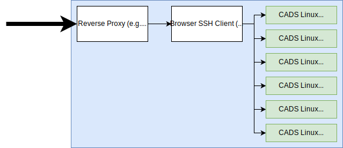

# Linux Session

This repository includes the material that we are going to be using for a session at CADS which involves teaching some basic Linux knowledge.

We decided the best way to learn would be a hands on approach. There's lots of solutions already such as [Katacoda](https://www.katacoda.com/) that we could have used, but they don't work with out school's firewall, so we thought the second best way would be to roll our own solution.

The best way to solve this would to have a big server running a bunch of VMs that each person connects to individually. This requires a lot of compute power to run though and we didn't have a big budget. The second best way is using Docker containers as they are a bit lighter-weight, so that's what we decided to go for in the end. Another way, would to have one Linux server with lots of accounts which are then dished out to each person.

A docker image allows us to install programs and add files/folders which will then be consistent for each instance of the container and we can easily scale up/down depending on how many people are turning up at the session.



The final setup will have a reverse proxy which takes traffic from a domain (e.g. linux.cadscheme.co.uk) and forwards it to the internally hosted SSH client. When someone connects through the SSH client it will communicate through an internal network to the relavent 'CADS Linux' container.

## Development

First, build the container:

```
docker build -t cads-linux .
```

Then run an instance of the container and attach a terminal into it.

```
docker run -it cads-linux /bin/bash
```

### Notes

- Text files (e.g in the `instructions` folder) need to have at least 1 newline at the end.

## Production Setup

- **[`caddy/caddy`](https://hub.docker.com/r/caddy/caddy)** - Reverse proxy for listening on a domain and forwarding to the internal web SSH container.
- **[`bwsw/webshell`](https://hub.docker.com/r/bwsw/webshell)** - Web SSH for allowing users to SSH into each of the containers through the internal network.
- **`cadscheme/cads-linux`** - The container setup with challenges.